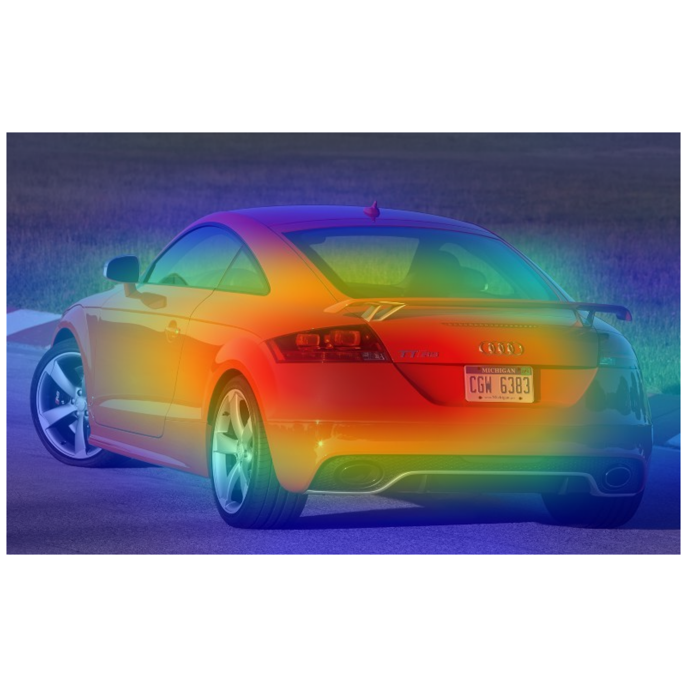

# ia-data-hack

# Challenge

- Fine-tuner un modèle ResNet-18 pour classifier des modèles de voitures.
- Mettre en avant l'explicabilité du modèle.

[Dataset link](https://www.kaggle.com/datasets/jutrera/stanford-car-dataset-by-classes-folder/)

# Rendu 

Rendu du projet 6milarite du groupe 3

Le notebook jupyter a été travaillé sur la plateforme Kaggle, il ne risque de ne pas fonctionner correctement si utilisé depuis une autre plateforme.

# Authors

Samy Hadj-said\
Virgile Hermant\
Angelo Eap\
Pierre-Louis Favreau\
Gautier Gally